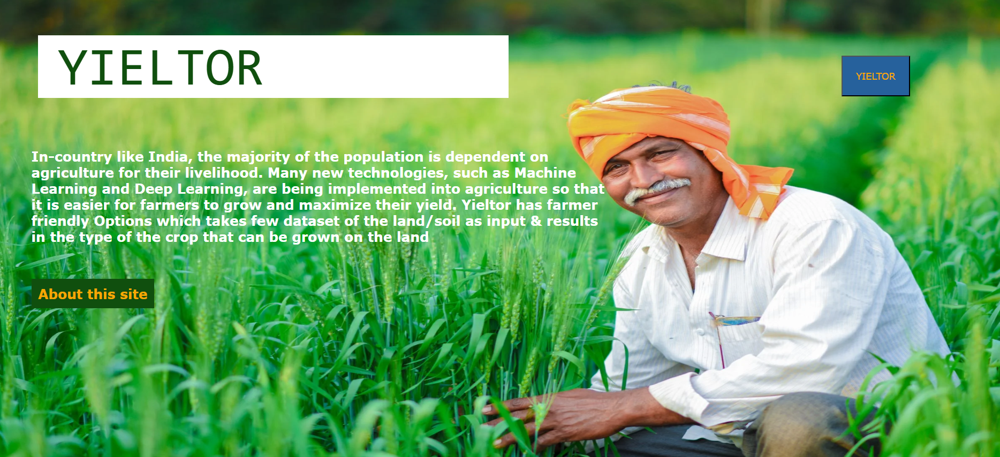
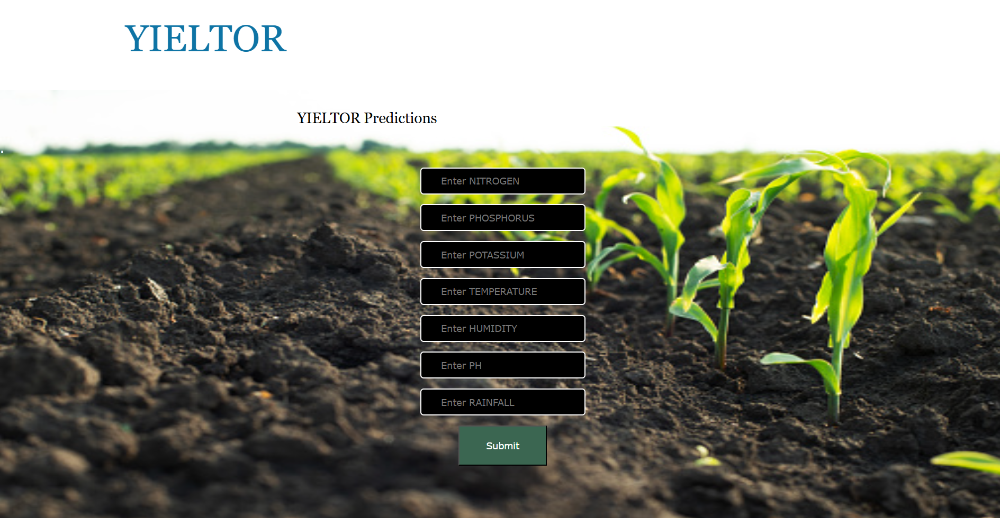
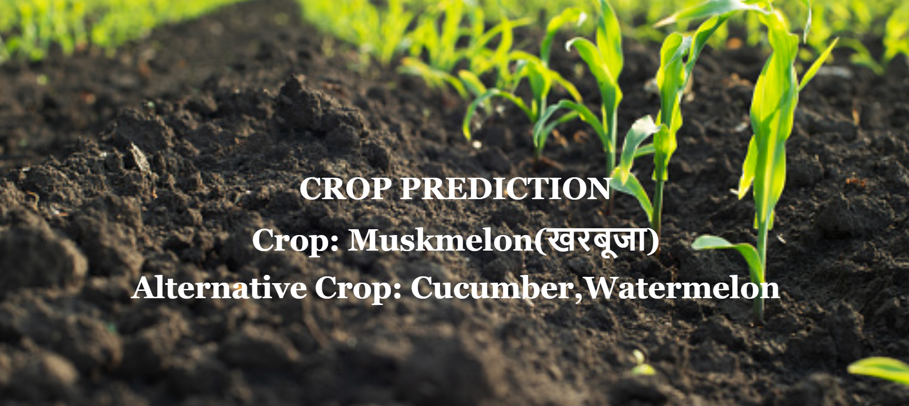

# YIELTOR: Crop Prediction and Analysis Web Application

Yieltor is a web application designed to assist farmers and agricultural experts by predicting crop yields and providing detailed analysis based on various machine learning models. The application allows users to input relevant data, submit it for analysis, and receive both a visual display of the results and an audible response.

## Home Page


## Input Fields


## Result

A voice is played as speech saying about whether the soil is good or bad and also says about best crop




## Features

### 🌱 Crop Prediction
- **Input Data:** Users can input various parameters related to soil, weather, and other environmental factors.
- **Multiple Models:** The application utilizes several machine learning models, including:
  - Naive Bayes (NVB)
  - Passive Aggressive Classifier (PAC)
  - Support Vector Machine (SVM)
  - Random Forest (RF)

### 🎙️ Voice Feedback
- **Audible Results:** Once the prediction or analysis is complete, the results are spoken aloud using text-to-speech technology.
- **Visual Display:** In addition to the voice feedback, results are also displayed on the screen for easy reference.

### 📁 File Upload & Analysis
- **Results Display:** The processed results are shown on the screen and also conveyed through voice feedback.

## Getting Started

To get started with the Yeiltor project, clone the repository and follow the instructions below to set up your development environment.

### Prerequisites

- Python 3.x
- Django 2.x
- SQLite (or your preferred database)
- Any required Python packages as listed in `requirements.txt`

### Installation

1. **Clone the repository:**
    ```bash
    git clone https://github.com/yourusername/soil-kropter.git
    cd soil-kropter
    ```

2. **Install dependencies:**
    ```bash
    pip install -r requirements.txt
    pip install pandas
    pip install emoji
    pip install --upgrade pip setuptools
    pip install matplotlib
    pip install scikit-learn
    pip install seaborn
    pip install pyttsx3
    pip install pymysql
    pip install openpyxl
    ```

3. **Apply migrations:**
    ```bash
    python manage.py migrate
    ```

4. **Run the development server:**
    ```bash
    python manage.py runserver
    ```

5. **Access the application:**
    Open your browser and navigate to `http://127.0.0.1:8000/`.

## Usage

- **Input Data:** Fill in the required fields on the form and submit.
- **View Results:** Listen to the voice feedback and check the visual results on the screen.
- **Explore Models:** Experiment with different machine learning models to see how they perform on your data.

## Future Scope
- **Fertilizer Recommendation:** Based on the crop prediction, the app also provides fertilizer recommendations.
- **CSV/XLSX Upload:** Users can upload CSV or Excel files containing relevant data for bulk analysis.<br>
🛠️ User Management
- **User Authentication:** The app includes user registration and login features to ensure secure access.
- **Dashboard:** After logging in, users are presented with a dashboard where they can access various tools and features.


## Contributing

Contributions are welcome! Please feel free to submit a Pull Request.
